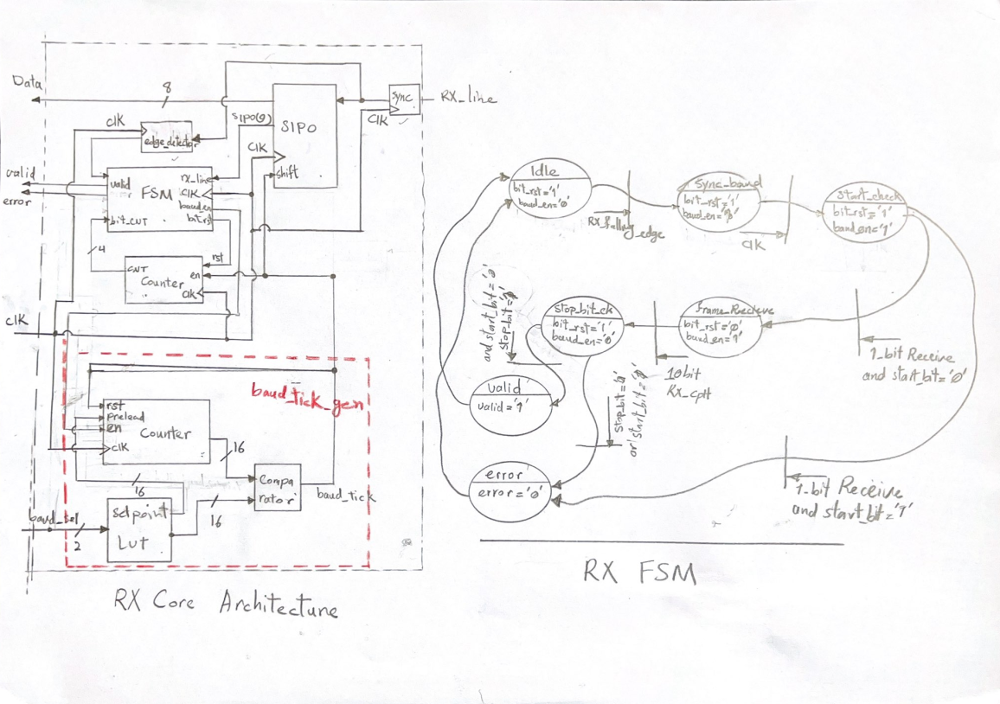
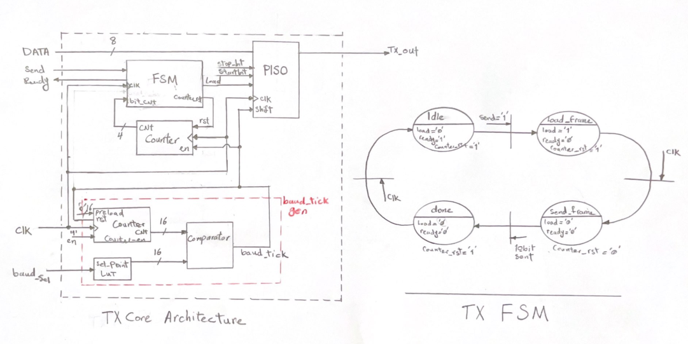

# UART RTL Design Project

## Overview



This project is an educational RTL implementation of a complete UART (Universal Asynchronous Receiver/Transmitter) communication module using VHDL.

The design includes both:

- UART Transmitter Core (TX Core)
- UART Receiver Core (RX Core)

The project was developed as part of a digital design course to demonstrate the architecture, implementation, and verification of UART communication systems at the RTL level.

The implementation focuses on:

- Modular RTL design
- FSM-based communication control
- Configurable baud-rate generation
- Simulation-driven verification
- Clean and readable VHDL coding style

This repository is intended for learning and educational purposes rather than production deployment.

---

# Features

## UART TX Core

- 1 Start Bit
- 8 Data Bits
- 1 Stop Bit
- Multiple selectable baud rates
- FSM-controlled serial transmission
- Parallel-to-Serial conversion using PISO

## UART RX Core

- Start bit detection
- Serial-to-Parallel conversion using SIPO
- Data validation logic
- Framing control FSM
- Synchronization and edge detection blocks
- Error detection support

---

# Project Structure
```text
uart_rtl/
│
├── rtl/
│   ├── uart_tx_core.vhd
│   ├── uart_rx_core.vhd
│   ├── tx_fsm.vhd
│   ├── rx_fsm.vhd
│   ├── piso.vhd
│   ├── sipo.vhd
│   ├── baud_tick_gen.vhd
│   ├── sample_tick_gen.vhd
│   ├── rate_selector.vhd
│   ├── baud_rate_lut.vhd
│   ├── synchronizer.vhd
│   ├── falling_edge_detector.vhd
│   ├── comparator.vhd
│   ├── CounterNb.vhd
│   └── counterNb_en.vhd
│
├── tb/
│   ├── tb_uart_tx_core.vhd
│   ├── tb_uart_rx_core.vhd
│   ├── tb_tx_fsm.vhd
│   ├── tb_rx_fsm.vhd
│   ├── tb_piso.vhd
│   ├── tb_sipo.vhd
│   ├── tb_baud_tick_gen.vhd
│   └── other testbenches
│
├── sim/
│   ├── run.do
│   ├── run_tb_uart_tx_core.do
│   ├── run_tb_rx_fsm.do
│   ├── run_tb_tx_fsm.do
│   └── simulation scripts
│
├── docs/
│   ├── TX_Core_Architecture.pdf
│   ├── RX_Core_Architecture.pdf
│   ├── tx_core_architecture.png
│   ├── rx_core_architecture.png
│   └── simulation results and diagrams
│
└── README.md
```
# Verification

Testbenches have been developed for:

- Individual RTL modules
- TX Core
- RX Core
- FSM blocks
- Tick generators
- Shift registers

The verification environment uses:

- Self-checking testbenches
- UART frame generation procedures
- Timing-based serial line stimulation
- Functional waveform analysis using ModelSim

---

# Simulation

ModelSim simulation scripts are available in the `sim/` directory.

Example:
```tcl
do run_tb_uart_tx_core.do
or
do tb_uart_rx_core.do
```
# Tools

Recommended simulation environment:

- ModelSim / QuestaSim

Language:

- VHDL

---

# Educational Goals

This project demonstrates:

- UART protocol fundamentals
- FSM design techniques
- Serial communication principles
- RTL modularization
- VHDL testbench development
- Functional verification methodology

---

# Notes

- Backup versions of source files are stored with `.bak` extension.
- The design prioritizes readability and educational clarity.
- The project can be extended with parity support, configurable frame sizes, and FIFO buffering.

---

# Author

Educational UART RTL Design Project  
Digital Design and Verification Practice
`


